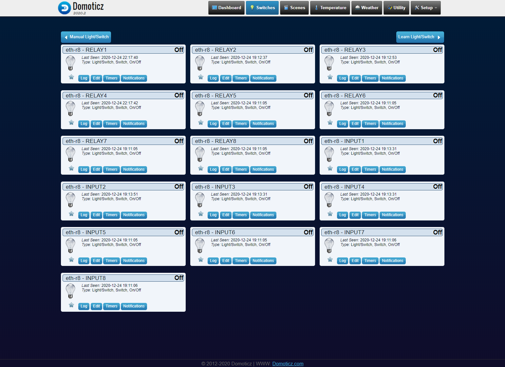
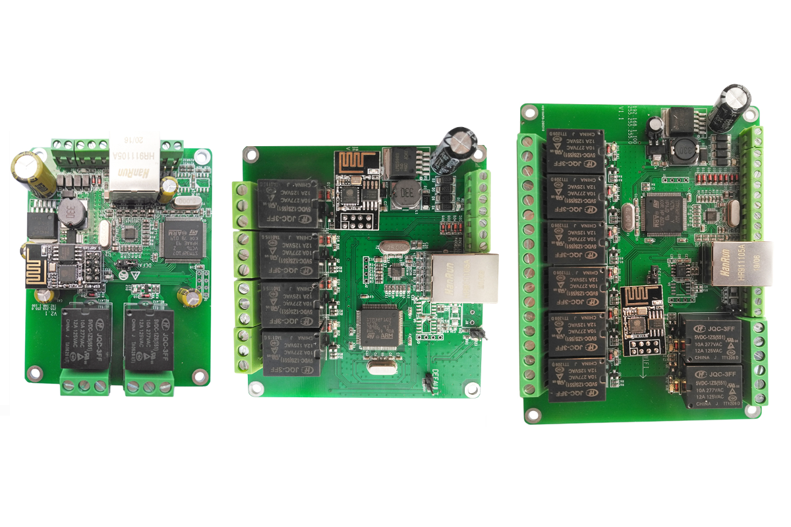

# Domoticz Dingtian Relay Plugin
Domoticz Python plugin for [Dingtian Relay](https://www.dingtian-tech.com/us_en/product.html?type=relay)
,support Ethernet and WiFi interface
## Function
- Relay ON/OFF
- Relay Parity Mutux
- Digital Input Status



## Prerequisites
- Relay Controller order from [Dingtian Aliexpress Store](https://www.aliexpress.com/item/4000999069820.html)
- Make sure that your Domoticz supports Python plugins (https://www.domoticz.com/wiki/Using_Python_plugins)


## Installation
1. Clone repository into your Domoticz plugins folder
```
cd domoticz/plugins
git clone https://github.com/dtlzp/Domoticz-Dingtian-Relay-Plugin.git dingtian
```
2. Restart domoticz
3. Make sure that "Accept new Hardware Devices" is enabled in Domoticz settings
4. Go to "Hardware" page and add new item with type "Dingtian Relay"
5. Set your Relay Controller address, port, channel, password to plugin settings

Once plugin receive device list from Relay Controller it will create appropriate Domoticz devices. You will find these devices on `Setup -> Devices` page.

## Plugin update

1. Go to plugin folder and pull new version
```
cd Domoticz/plugins/dingtian
git pull
```
2. Restart Domoticz

## Supported Dingtian devices
- Dingtian Relay 2 Channel DT-RELAY2
- Dingtian Relay 4 Channel DT-RELAY4
- Dingtian Relay 8 Channel DT-RELAY8

## About firmware version and plugins version
- [plugins V1.2.0](https://github.com/dtlzp/Domoticz-Dingtian-Relay-Plugin/tree/v1.2.0) for relay board firmware version >= 2.17.XX
- [plugins V1.1.0](https://github.com/dtlzp/Domoticz-Dingtian-Relay-Plugin/tree/v1.1.0) for relay board firmware version <= v2.16.XX

